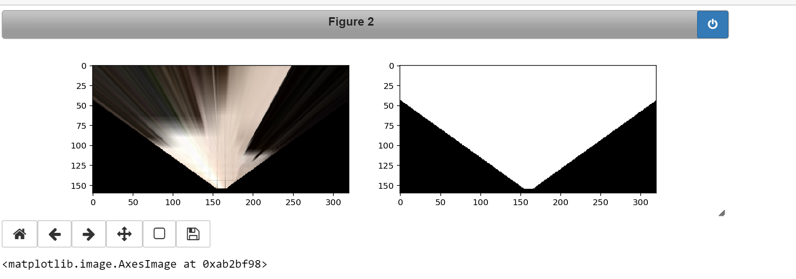
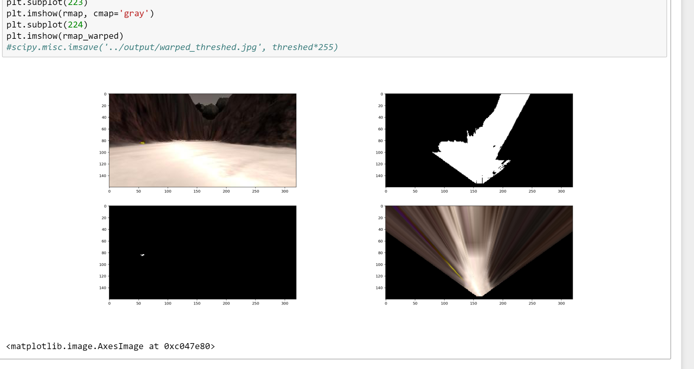
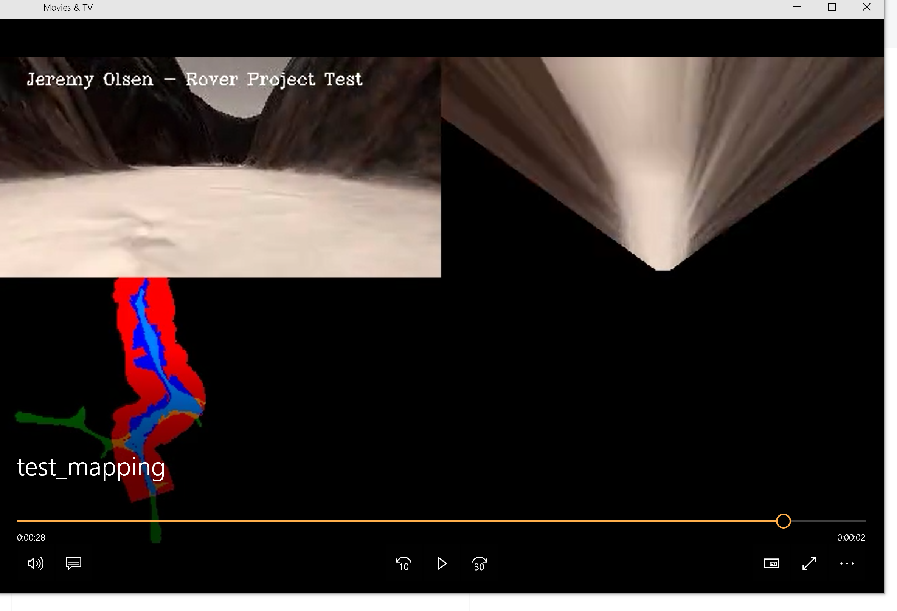
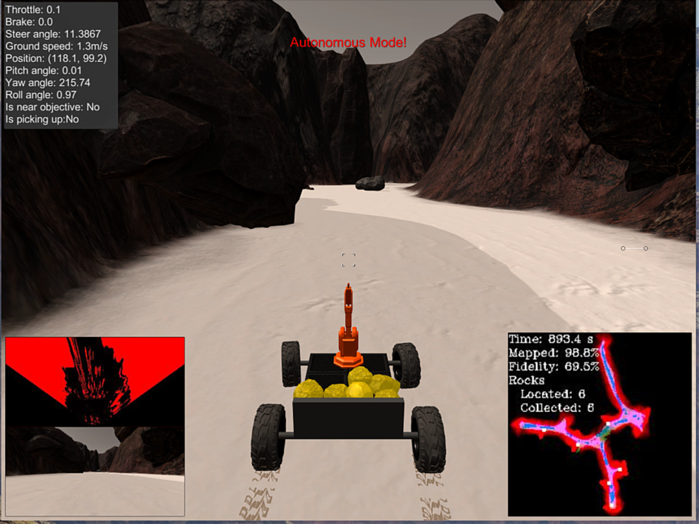
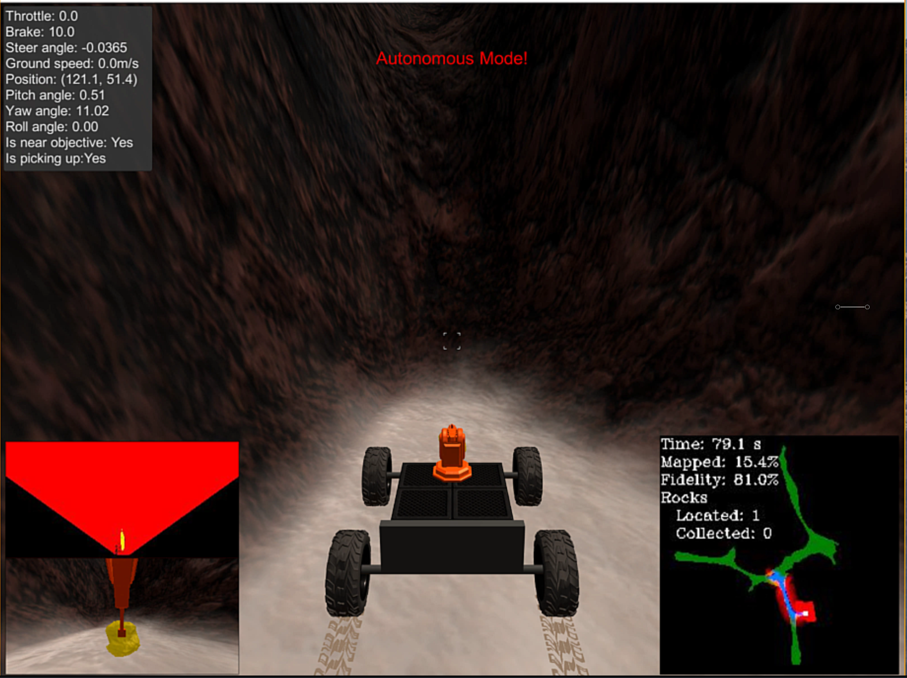

# Udacity Search Map Rover Project 
## Jeremy Olsen - slack: jolsen-oas

## Notebook Analysis

This was an much an introduction to using Jupyter Notebooks to do pre-processing of the images before using the similator.  This built up the fundamentals of processing images to determing what is navigatable terrain based upon colors of the terrain.  We would end up utilizing these techniques for the simulator portion of the project.

* **Color Thresholding section: color selection of obstacles and rock samples**
    * Modified all paths to data locations
    * Added the mask in perspect_transform and added it to the output
        * 
    * Created `find_rocks()` to look for gold pixels
        * look for gold pixels and create an image
        * warped and create an image  
    * Added more pics rendered all modifications in output to demonstrate rock being identified
        * 

* **Modified inline code of Coordinate Transforms section**
    * created a greyscale image for a test to see if mapping was increased per a hint that was in the lesson to play with different color types
    * create and tested the obstical map from the greyscale image 

        * **`image = mpimg.imread(img_list[idx])
warped, mask = perspect_transform(image, source, destination)`**
**`grayscaled = cv2.cvtColor(warped, cv2.COLOR_RGB2GRAY)
retval, threshold = cv2.threshold(grayscaled, 160, 255, cv2.THRESH_BINARY)`**
**`obstical_map = np.absolute(np.float32(threshed) - 1) * mask`**
        * 
        
* **Decribe process_image() method**
    * Create warped image and masked image from the dataset "Databucket
        * Data supplied from the recordings that we did early in the lesson
    * Apply the colorthreshold on the image
        * I'm testing the cv2 threshold methods using greyscale color type.  Noticed little or no differences between the color_thresh() method provided here.
    * gather rover coordinates from pixel arrays
    * Define worldsize and scale
    * process images using pix_to_world()
        * applied to both the perspective map and the obstical map
    * Apply both sets of pixel arrays to the data.worldmap per repective RGB channels
        * nav pixles are blue channel
        * obstacle pixles are red channel
    * create a rock map from the prespective pixel array
        * get coord pixels and process with pix_to_world
        * set to worldmap on all channels to result in a white rock pixel on the world map
    * create the video from all of the processed images
    
    

## Autonomous Navigation and Mapping

* **Created a YouTube video of a 6 for 6 run**
    * https://www.youtube.com/watch?v=FPyKJIwBdjY

* **Decription of the code added to `perception_step()` and changes to other utilized methods**
    * Nearly all of the same steps as process_image() in the notebook
    * preform a warp transform on the rover image coming from the Rover object
    * using color thresholding on the warped image to then be merged mask to deteremine
    * retreieve coordintes process via pix_to_world() for both pixel arrays
    * implemented find_rocks()
        * Added rock_angle and rock_dist to the Rover object to be used when picking up rocks around the map
        * Made a fix for cases where there were no pixels and the min arg was missing from the rock_dist array
    * Per discussion with Udacity folks and other students, was provided a sample of HSV and HSL color thresholding approach which increased the fidelity by nearly 10%
        * Additional tweaks to the sensitivity as the rover was affraid of rock shadows and considered them obstacles
        

* **Description of the `decision_step()` functions**
    * This was the most drastic of changes.  The if/else statement logic tree was already getting unweildly and needed a object oriented approach applied to it
        * Implemented a State Machine called DecisionDecions
            * Each state implements an `__init__()`, `update()`, `run()` and `next()` methods 
            * Each State is responsible for determining the next state based upon criteria
        * Created 5 separate states
            * Stop, MappingAndSeeking, PickUpGold, WhyDontYouGoToYourHome, and Stuck
     *  Implemented changes to the MappingAndSeeking state to follow the left wall by refininging the steering calcs
     * Stuck state is initiated when velocities in other states are equal to zero.
         * I randomly change the lenght of the stuck maneuver so that it doesn't get caught in the rocks and bouce back and forth infinately
         
         * Made the turning smarter based upon the direction of the mean angle of the rover and not just turn in one direction constantly
    
     *  PickUpGold state was the most challenging as syncing the state and Rover object when the rover was picking up were not timed correctly.  I loath adding flags to classes and found I had to add multiple to make it work
    
     *  Implemented a return to home state (WhyDontYouGoToYourHome).
         * Created new vars on the Rover object to store the origin coords
         * Created a `get_bearing_and_dist()` method
         * Had difficulty with getting the rover to follow the path based upon the origin.  Did further research and found that the best approach would have been to implement Path Planning which would of gridded out the world map and had knowledge of each area.  This seems lenghty and I tried to just work out and average of the mean and the bearing.  Sort of works..
         
* **Spent time in setting up a IDE based environment using PyCharms which allowed me to do advanced debugging techniques.**

* **Accomplished mapping ~99% of the worldmap and ~70% fidelity consistently**

* **Consistently was able to pickup all six of the rocks, including the randomly placed rocks behind the two rocks on the west side of the map.**
    * Pickup state did not do any special maneuvers to approach the rocks and so the rover would get stuck trying to retreive some of the rocks on the edges.  If left long enough it would eventually get to it and pick it up.  This could have been better refined.
    
    
    

